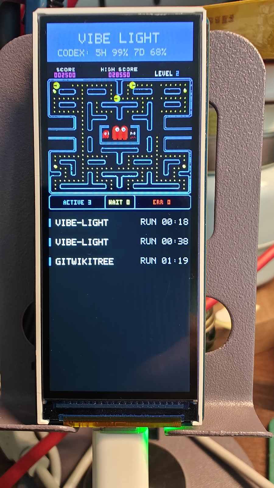

# Vibe Light

[English README](README.en.md)

Vibe Light 把本机 AI 编程工具的运行状态同步到一块实体桌面屏幕上。

项目由 macOS 原生桌面应用和 ESP32-S3 显示固件组成。Codex / Claude 通过本地 hooks 写入事件，macOS app 将事件归一化为紧凑的任务状态，再通过 BLE 写入 ESP32-S3。硬件屏幕会展示当前是否运行中、是否等待批准、最近错误、Codex 用量压力，以及运行状态下的 Codex 吃豆人迷宫动画。

<table>
  <tr>
    <td align="center" width="50%">
      
    </td>
    <td align="center" width="50%">
      
    </td>
  </tr>
  <tr>
    <td align="center"><sub>真实 ESP32-S3 设备上的动态运行效果。</sub></td>
    <td align="center"><sub>运行中状态实拍，便于查看任务列表、计时和迷宫细节。</sub></td>
  </tr>
</table>

## 能做什么

- 展示本机 AI 编程工具当前是空闲、运行中、等待用户、成功完成还是发生错误。
- 将多个 Codex / Claude 任务聚合成一个适合硬件显示的状态视图。
- 在屏幕上显示最多 5 条任务摘要、活跃 / 等待 / 错误计数、任务新鲜度、运行时长和 Codex context 用量摘要。
- 驱动竖屏 320 x 820 ESP32-S3 LCD 界面，并在 `busy` 状态下播放 Codex 迷宫动画。
- 提供 macOS app 内固件烧录流程，测试用户无需安装 ESP-IDF 即可初始化目标 ESP32-S3 设备。

## 当前状态

Vibe Light 目前已有 `v0.1.1` macOS release，核心链路已经具备 macOS app、ESP32-S3 固件、BLE 状态同步、app 内固件烧录和 Sparkle 自动更新闭环。

当前 release 包内置：

- notarized macOS app。
- 面向 Waveshare `ESP32-S3-LCD-3.16` 的预编译固件。
- 固件烧录 helper 和 bundled Python runtime。
- `esptool` 依赖，以及对应的 open-source notices、source offer 和 source archive。
- Sparkle 自动更新入口，Apple Silicon 默认通过 GitHub latest release `appcast.xml` 检查稳定版本，Intel 版本使用 `appcast-x86_64.xml`。

发布流程已经完成 Developer ID 签名、notarization、release checklist、open-source notices、source offer 和 Sparkle appcast 检查；`v0.1.1` 下载包已覆盖启动 app、从旧版通过默认 stable feed 更新、通过 USB 烧录 ESP32-S3 固件、BLE 重连和读取设备 health 的真实用户路径验证。release workflow 现在会分别生成 `arm64` 和 `x86_64` notarized zip，以匹配 Apple Silicon 和 Intel Mac 的 bundled Python runtime。

## 硬件

当前支持的目标设备是：

- Waveshare `ESP32-S3-LCD-3.16`
- ESP32-S3，带 8 MB PSRAM
- 320 x 820 ST7701 RGB LCD
- USB 用于固件烧录
- BLE 用于状态同步

硬件事实和官方资料入口见 [docs/hardware.md](docs/hardware.md)。

## 安装试用

普通测试用户可以直接使用 GitHub release 包，不需要从源码构建固件：

1. 从 [GitHub Releases](https://github.com/miclle/vibe-light/releases) 下载与你的 Mac 匹配的最新发布包：新双平台 release 中 Apple Silicon 使用 `VibeLightApp-*-arm64-notarized.zip`，Intel 使用 `VibeLightApp-*-x86_64-notarized.zip`；旧 release 若只有 `VibeLightApp-*-notarized.zip`，则使用该单包。
2. 用 Finder 或 Archive Utility 解压 zip；如果使用命令行，建议用 `ditto -x -k`。
3. 打开 `VibeLightApp.app`。
4. 用 USB 数据线连接 ESP32-S3 开发板。
5. 在 app 的固件烧录页面读取芯片，并写入内置固件。
6. 烧录完成后按需点按 `RST`，再在 app 中连接 `VibeLight-S3`。
7. 在 app 中安装 Codex / Claude hooks，然后正常使用你的 AI 编程工具。

内置烧录路径不要求用户安装 ESP-IDF、`idf.py`、Homebrew `esptool` 或本地 Python 环境。
后续稳定版本会通过 app 菜单中的“检查更新...”和后台自动检查发现新 release。

## macOS App

桌面端位于 [projects/macos/desktop](projects/macos/desktop)，使用 SwiftPM、SwiftUI 和 CoreBluetooth。

当前包含五个主要界面：

- 通用：查看当前硬件显示状态、最近事件桥接状态、手动调试状态和基础偏好。
- 智能体安装：安装或卸载 Codex / Claude 的 Vibe Light hooks。
- 硬件设备：扫描、连接设备、发送状态包、读取 health packet，并发送显示演示包。
- 固件烧录：引导用户完成 USB 芯片读取、固件写入、重启、BLE 重连和健康状态验证。
- 事件：查看本机采集到的 hook 事件和诊断信息。

Hook CLI 会保持安静：它从 stdin 读取 JSON，追加写入 `~/Library/Application Support/VibeLight/events.jsonl`；失败时只写 stderr，并以 fail-open 方式退出，避免影响 Codex / Claude 原有工作流。

## ESP32-S3 固件

固件位于 [projects/esp32](projects/esp32)。它负责：

- 以 `VibeLight-S3` 名称广播 BLE Peripheral。
- 接收 macOS app 写入的紧凑 UTF-8 JSON `StatusPacket`。
- 返回包含 uptime、连接状态、最近显示状态、heap、render tick、背光状态和最近解析错误的 health packet。
- 使用轻量 framebuffer renderer 直接驱动 Waveshare LCD。
- 同时兼容当前 `v: 2` 多任务状态包和旧的 `v: 1` 单状态包。

协议、状态模型和跨端职责见 [docs/architecture.md](docs/architecture.md)。固件细节见 [projects/esp32/README.md](projects/esp32/README.md)。

## 从源码构建

首次搭建开发环境：

```bash
make check-env
make setup
```

`make setup` 可以交互式安装缺失的 Homebrew 依赖，并在默认路径 `~/esp/esp-idf` 下安装 ESP-IDF。国内网络下载 ESP-IDF 较慢时，可以使用：

```bash
script/setup_env.sh --install --china-mirror
```

构建、测试并启动 macOS app：

```bash
make desktop-build
make desktop-test
make desktop-run
```

运行固件 host-side 测试和屏幕预览生成：

```bash
make esp32-test
make esp32-preview
```

本机有 ESP-IDF 时，从源码构建并烧录固件：

```bash
make esp32-build
make esp32-flash ESP32_PORT=/dev/cu.usbmodemXXXX
```

只有手动运行 `idf.py` 时，才需要进入已激活的 ESP-IDF shell：

```bash
make idf-shell
```

## 验证

快速验证 desktop 逻辑、协议解析、固件 host-side 测试、屏幕预览和 whitespace：

```bash
make quick
```

包含 ESP32 固件构建的完整验证：

```bash
make verify
```

文档-only 改动至少运行：

```bash
make docs-check
```

固件屏幕预览会生成到：

```text
/tmp/vibe-maze-preview.png
/tmp/vibe-screen-preview.png
```

## 项目结构

```text
projects/
  macos/
    desktop/   # macOS SwiftPM app、Hook CLI、BLE client、测试
  esp32/       # ESP32-S3 固件和 host-side 测试
docs/          # 架构、硬件、固件烧录和发布记录
script/        # 环境搭建、验证、打包和发布脚本
```

## 文档

- [架构设计](docs/architecture.md)
- [硬件记录](docs/hardware.md)
- [固件烧录流程](docs/desktop-firmware-flashing.md)
- [ESP32 固件说明](projects/esp32/README.md)
- [路线图和验证记录](TODO.md)
- [Agent 工作指南](AGENTS.md)

## License

Vibe Light 自有源码使用 [Vibe Light Non-Commercial Source License](LICENSE)。第三方组件继续遵循各自的上游许可证。
