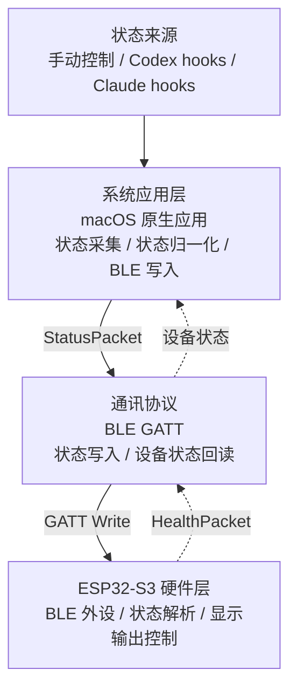
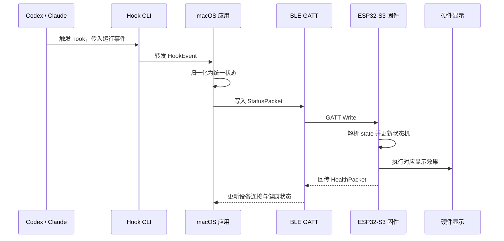

# Vibe Light 架构设计

## 目标

Vibe Light 是一个智能硬件项目，用于把本机 AI 编程工具的运行状态同步到实体硬件显示设备。

项目核心架构由三部分组成：

- **系统应用层**：macOS 原生应用，负责接收 Codex / Claude 等工具的状态，并决定要展示的硬件显示状态。
- **通讯协议**：macOS 应用与 ESP32-S3 之间的 BLE GATT 协议，负责可靠传递状态。
- **ESP32-S3 硬件层**：ESP32-S3 固件和显示输出控制，负责接收状态并驱动 LED 或 IPS TFT 小液晶彩屏。

这三层分别处理状态来源、状态传输和硬件呈现，彼此通过稳定的数据契约连接。

---

## 架构总览

<div style="background:#fff">



</div>

## 核心流程

核心流程描述一次工具状态变化如何最终变成硬件显示输出。它属于架构设计，因为它明确了系统应用层、通讯协议和硬件层之间的运行时协作关系。

<div style="background:#fff">



</div>

## 分层职责

| 层级 | 核心职责 | 不负责 |
| --- | --- | --- |
| 系统应用层 | 接收工具状态、归一化状态、维护当前显示状态、连接 ESP32-S3、写入 BLE 状态包。 | 不直接控制 LED 引脚或屏幕像素，不关心硬件动画细节。 |
| 通讯协议 | 定义 BLE 服务、特征、状态包、健康状态包和兼容性规则。 | 不决定 Codex / Claude 的业务语义，不实现灯效或屏幕界面。 |
| ESP32-S3 硬件层 | 广播 BLE 设备、接收状态包、解析状态、执行显示输出、回传设备健康状态。 | 不理解 AI 工具细节，不做复杂会话管理。 |

---

## 系统应用层

系统应用层是运行在 macOS 上的本地应用。它是整个产品的状态中枢。

### 输入来源

系统应用层支持三类状态输入：

- **手动控制**：应用界面中的状态按钮，用于调试 BLE 和硬件显示效果。
- **Codex hooks**：Codex 通过 hook 调用本地 CLI，把运行事件传给应用。
- **Claude hooks**：Claude Code 通过 hook 调用本地 CLI，把运行事件传给应用。

进程检测不作为主状态来源。它只能判断“是否在运行”，无法可靠区分“正在执行”“等待用户”“成功完成”“执行失败”等状态。

### 应用内模块

| 模块 | 职责 |
| --- | --- |
| SwiftUI UI | 展示连接状态、当前硬件显示状态和手动控制入口。 |
| Hook CLI | 供 Codex / Claude hook 调用，读取 stdin JSON 并转发到本地应用。 |
| Local Bridge | macOS 应用内的本地 Unix socket 服务，接收 Hook CLI 事件。 |
| 状态归一化 | 把不同工具的 hook 事件映射成统一状态。 |
| App State | 保存当前状态、设备连接状态和最近一次事件。 |
| BLE Client | 使用 CoreBluetooth 扫描、连接 ESP32-S3，并写入状态包。 |

### 状态模型

系统应用层只向硬件输出少量稳定状态：

| 状态 | 含义 |
| --- | --- |
| `idle` | 当前没有活跃任务。 |
| `busy` | 工具正在执行或处理任务。 |
| `waiting` | 工具正在等待用户批准或回答。 |
| `success` | 最近一次任务成功完成。 |
| `error` | 最近一次任务失败、被拒绝或需要处理。 |
| `offline` | macOS 应用未连接硬件。 |

### Hook 事件映射

系统只保留硬件显示需要的语义，不把完整会话模型下沉到硬件。

| Hook 事件 | 统一状态 | 说明 |
| --- | --- | --- |
| `SessionStart` | `busy` | 新会话启动或恢复。 |
| `UserPromptSubmit` | `busy` | 用户提交了新任务。 |
| `PreToolUse` | `busy` | 工具即将执行。 |
| `PostToolUse` | `busy` | 单个工具完成，但当前轮次可能仍在继续。 |
| `PermissionRequest` | `waiting` | 工具等待用户批准或回答。 |
| `Stop` | `success` | 当前轮次完成。 |
| `SessionEnd` | `success` | 会话结束。 |
| `PostToolUseFailure` / `StopFailure` / `PermissionDenied` | `error` | 工具失败、轮次失败或权限被拒绝。 |

### 设计原则

- **Hook first**：优先使用 Codex / Claude hooks 获取真实状态。
- **Fail open**：Hook CLI 无法连接本地应用时直接退出，不影响 Codex / Claude 原工作流。
- **状态收敛**：系统应用层负责把复杂事件收敛为少量硬件状态。
- **硬件无感知**：ESP32-S3 不需要知道事件来自 Codex、Claude 还是手动控制。

---

## 通讯协议

通讯协议定义 macOS 应用和 ESP32-S3 之间的 BLE GATT 契约。

### BLE 角色

| 端 | BLE 角色 | 说明 |
| --- | --- | --- |
| macOS 应用 | Central | 扫描、连接 ESP32-S3，并写入状态。 |
| ESP32-S3 | Peripheral | 广播设备、暴露 GATT 服务、接收状态。 |

### GATT 设计

| 项 | 值 |
| --- | --- |
| 设备名称前缀 | `VibeLight` |
| Service UUID | `7d8f0001-7b9a-4f0b-9e8a-8b4c2c7f1000` |
| 状态写入特征 UUID | `7d8f0002-7b9a-4f0b-9e8a-8b4c2c7f1000` |
| 健康状态特征 UUID | `7d8f0003-7b9a-4f0b-9e8a-8b4c2c7f1000` |

### 状态包

macOS 应用向状态写入特征写入 UTF-8 JSON。

```json
{
  "v": 1,
  "source": "codex",
  "state": "busy",
  "detail": "running",
  "ts": 1780300800000
}
```

| 字段 | 类型 | 必填 | 说明 |
| --- | --- | --- | --- |
| `v` | number | 是 | 协议版本，当前固定为 `1`。 |
| `source` | string | 是 | 状态来源：`manual`、`codex`、`claude`、`other`。 |
| `state` | string | 是 | 状态值：`idle`、`busy`、`waiting`、`success`、`error`、`offline`。 |
| `detail` | string | 否 | 简短诊断信息，用于调试和界面展示；macOS 端限制为最多 80 个 UTF-8 字节。 |
| `ts` | number | 是 | macOS 应用生成的 Unix 毫秒时间戳。 |

状态写入包必须保持小于 256 字节，以匹配 ESP32-S3 固件当前的 GATT 写入缓冲区。macOS 端只发送已经归一化的短文本，不把完整 hook payload 写入硬件。

### 健康状态包

ESP32-S3 通过健康状态特征返回设备状态。

```json
{
  "v": 1,
  "device": "VibeLight-S3",
  "uptimeMs": 12000,
  "connected": true,
  "lastState": "busy"
}
```

| 字段 | 类型 | 说明 |
| --- | --- | --- |
| `v` | number | 协议版本。 |
| `device` | string | 设备名称。 |
| `uptimeMs` | number | 固件运行时长，单位为毫秒。 |
| `connected` | boolean | 是否有 Central 连接。 |
| `lastState` | string | 最近一次应用到硬件显示输出的状态。 |

macOS 应用在发现健康状态特征后会读取一次；后续每次状态写入响应成功后再读取一次，用于确认固件运行时间和最近显示状态。

### 协议原则

- **小包优先**：状态包只传必要字段，避免把会话详情传给硬件。
- **版本化**：所有包都包含 `v`，协议升级时可以兼容旧固件。
- **单向控制为主**：macOS 写入状态，ESP32-S3 回传健康状态。
- **事件驱动**：设备可写入后，macOS 自动发送最近状态；后续 hook 或手动状态变化会自动同步到已连接设备。
- **可降级**：ESP32-S3 收到未知状态时应降级为 `idle` 或保留当前状态，不应重启或卡死。

---

## ESP32-S3 硬件层

ESP32-S3 硬件层负责把通讯协议转换为可见的硬件输出。输出设备可以是单颗 LED / LED 灯珠，也可以是 IPS TFT 小液晶彩屏。

### 固件模块

| 模块 | 职责 |
| --- | --- |
| BLE Server | 初始化 BLE，广播设备，暴露 GATT 服务和特征。 |
| Status Parser | 解析状态 JSON，校验协议版本和状态值。 |
| Display Controller | 根据状态驱动具体输出设备，可以是 LED 灯效，也可以是 IPS TFT 屏幕界面。 |
| Health Reporter | 维护运行时间、连接状态和最近状态，用于健康状态特征。 |

### 显示输出映射

| 状态 | LED 默认效果 | IPS TFT 默认效果 |
| --- | --- | --- |
| `idle` | 柔和白色呼吸。 | 显示空闲状态、工具名称和低亮度背景。 |
| `busy` | 蓝色脉冲。 | 显示运行中状态、来源工具和动态进度感。 |
| `waiting` | 紫色慢脉冲。 | 显示等待用户处理，突出提示色。 |
| `success` | 绿色闪烁后回到 `idle`。 | 显示完成提示，短暂停留后回到空闲界面。 |
| `error` | 红色双闪后回到 `idle`。 | 显示错误提示，短暂停留后回到空闲界面。 |
| `offline` | 琥珀色慢闪。 | 显示未连接或等待应用连接。 |

### 硬件边界

硬件层的架构边界：

- 一个 ESP32-S3 开发板。
- 板载 RGB LED、单颗外接可寻址灯珠，或一块 IPS TFT 小液晶彩屏。
- 一个 BLE GATT 服务。
- 一个状态写入特征。
- 一个健康状态读取 / 通知特征。

灯珠数量、多灯动画、屏幕尺寸、屏幕 UI 细节、外壳结构、电源管理和配网能力不属于架构层核心边界。

### 固件原则

- **不理解工具语义**：固件只识别 `state`，不关心 Codex / Claude 事件。
- **状态机简单**：临时状态（`success` / `error`）完成显示后自动回到 `idle`。
- **输出设备可替换**：BLE 协议只传状态，LED 和 IPS TFT 都通过硬件层内部的 Display Controller 适配。
- **非阻塞渲染**：LED 动画或屏幕刷新应由主循环 tick 驱动，避免阻塞 BLE 回调。
- **错误可恢复**：收到坏包、未知版本或未知状态时保持可用。
