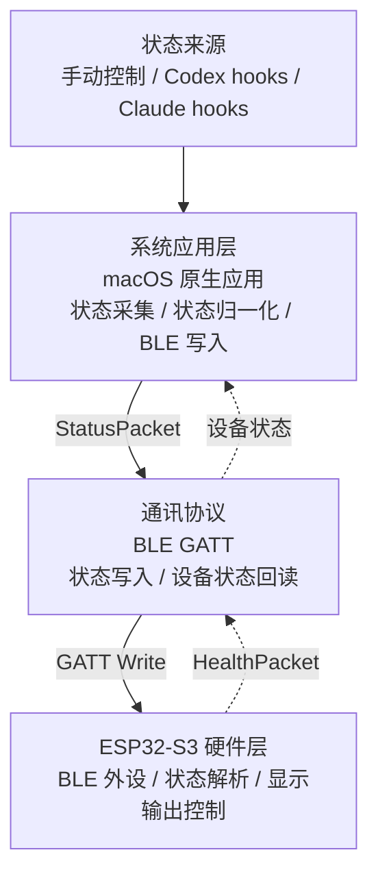
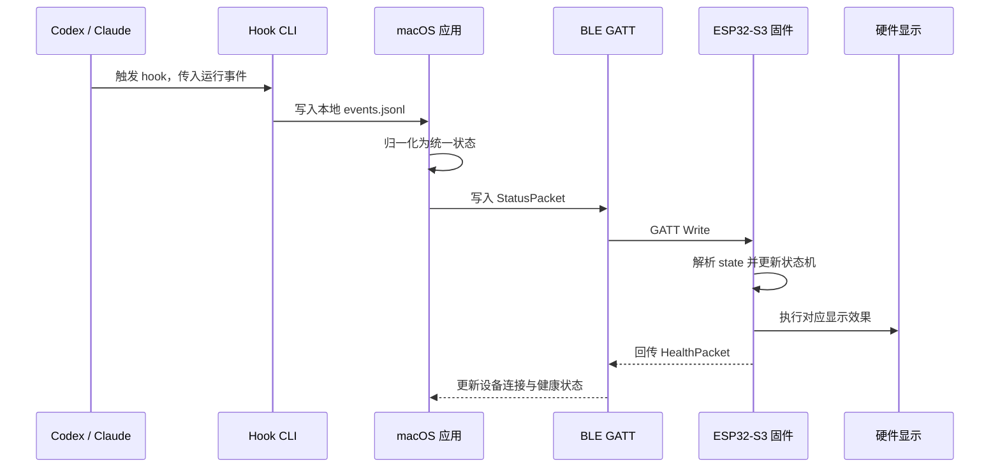

# Vibe Light 架构设计

## 目标

Vibe Light 是一个智能硬件项目，用于把本机 AI 编程工具的运行状态同步到实体硬件显示设备。

项目核心架构由三部分组成：

- **系统应用层**：macOS 原生应用，负责接收 Codex / Claude 等工具的状态，并决定要展示的硬件显示状态。
- **通讯协议**：macOS 应用与 ESP32-S3 之间的 BLE GATT 协议，负责可靠传递状态。
- **ESP32-S3 硬件层**：ESP32-S3 固件和显示输出控制，负责接收状态并驱动 Waveshare `ESP32-S3-LCD-3.16` 的 LCD。

这三层分别处理状态来源、状态传输和硬件呈现，彼此通过稳定的数据契约连接。

---

## 架构总览

<div style="background:#fff">



</div>

## 核心流程

核心流程描述一次工具状态变化如何最终变成硬件显示输出。它属于架构设计，因为它明确了系统应用层、通讯协议和硬件层之间的运行时协作关系。

<div style="background:#fff">



</div>

## 分层职责

| 层级 | 核心职责 | 不负责 |
| --- | --- | --- |
| 系统应用层 | 接收工具状态、归一化状态、维护当前显示状态、连接 ESP32-S3、写入 BLE 状态包。 | 不直接控制 LED 引脚或屏幕像素，不关心硬件动画细节。 |
| 通讯协议 | 定义 BLE 服务、特征、状态包、健康状态包和兼容性规则。 | 不决定 Codex / Claude 的业务语义，不实现灯效或屏幕界面。 |
| ESP32-S3 硬件层 | 广播 BLE 设备、接收状态包、解析状态、执行显示输出、回传设备健康状态。 | 不理解 AI 工具细节，不做复杂会话管理。 |

---

## 系统应用层

系统应用层是运行在 macOS 上的本地应用。它是整个产品的状态中枢。

### 输入来源

系统应用层支持三类状态输入：

- **手动控制**：应用界面中的状态按钮，用于调试 BLE 和硬件显示效果。
- **Codex hooks**：Codex 通过 hook 调用本地 CLI，把运行事件传给应用。
- **Claude hooks**：Claude Code 通过 hook 调用本地 CLI，把运行事件传给应用。

进程检测不作为主状态来源。它只能判断“是否在运行”，无法可靠区分“正在执行”“等待用户”“成功完成”“执行失败”等状态。

### 应用内模块

| 模块 | 职责 |
| --- | --- |
| SwiftUI UI | 展示连接状态、当前硬件显示状态和手动控制入口。 |
| Hook CLI | 供 Codex / Claude hook 调用，读取 stdin JSON 并追加到本地事件日志。 |
| Event Log Bridge | 使用 Application Support 下的 `events.jsonl` 作为 fail-open 事件桥，应用轮询最近事件。 |
| 状态归一化 | 把不同工具的 hook 事件映射成统一状态。 |
| Task Tracker | 根据 task id、workspace 或 source 聚合同步到达的多任务事件，生成整体状态、Codex 用量摘要和最多 5 条屏幕任务摘要；Codex memory-writing 辅助事件会被过滤，避免干扰真实工作状态。 |
| App State | 保存当前状态、设备连接状态和最近一次事件。 |
| BLE Client | 使用 CoreBluetooth 扫描、连接 ESP32-S3，启动时可按偏好自动连接第一台发现的 VibeLight 设备，异常断开或连接失败后按偏好恢复扫描，并在设备就绪后写入最新状态包。 |
| 硬件演示包 | 在“硬件设备”页提供固定 v2 `StatusPacket` 场景，用来调试屏幕任务列表；演示包直接写入 BLE，不写入 hook 事件日志。 |

### 状态模型

系统应用层只向硬件输出少量稳定状态：

| 状态 | 含义 |
| --- | --- |
| `idle` | 当前没有活跃任务。 |
| `busy` | 工具正在执行或处理任务。 |
| `waiting` | 工具正在等待用户批准或回答。 |
| `success` | 最近一次任务成功完成。 |
| `error` | 最近一次任务失败、被拒绝或需要处理。 |
| `offline` | macOS 应用未连接硬件。 |

### Hook 事件映射

系统只保留硬件显示需要的语义，不把完整会话模型下沉到硬件。

| Hook 事件 | 统一状态 | 说明 |
| --- | --- | --- |
| `SessionStart` | `busy` | 新会话启动或恢复。 |
| `UserPromptSubmit` | `busy` | 用户提交了新任务。 |
| `PreToolUse` | `busy` | 工具即将执行。 |
| `PostToolUse` | `busy` | 单个工具完成，但当前轮次可能仍在继续。 |
| `PermissionRequest` | `waiting` | 工具等待用户批准或回答。 |
| `Stop` | `success` | 当前轮次完成。 |
| `SessionEnd` | `success` | 会话结束。 |
| `PostToolUseFailure` / `StopFailure` / `PermissionDenied` | `error` | 工具失败、轮次失败或权限被拒绝。 |

### 多任务聚合

Codex / Claude 可能同时运行多个任务，事件到达顺序也可能穿插。macOS 应用负责维护任务聚合状态，ESP32-S3 不直接理解任务生命周期。

聚合规则：

1. 任一任务处于 `waiting` 时，整体显示 `waiting`。
2. 否则任一任务处于 `busy` 时，整体显示 `busy`。
3. 没有活跃任务时，整体显示 `idle`，但最近的 `error` / `success` 任务仍可作为任务行和 `LAST ERR` / `LAST OK` 摘要展示。

当前 BLE 状态包使用 `v: 2`，除了整体 `source` / `state` / `detail` 外，还包含任务计数、Codex 用量摘要和最多 5 个任务行。ESP32-S3 屏幕顶部显示聚合状态和 Codex 5h / 7d 剩余百分比；当某个窗口剩余不高于 20% 且带有 reset 时间时，5h / 7d 百分比仍常驻显示，顶部状态区下沿会额外提示 `5H RESET 45m` 这类剩余时长。中间保留给参考迷宫动画舞台，底部贴边区域显示任务计数、列表和任务新鲜度 / 运行时长；任务 context 有 token 数据时可显示 `CTX 4.2K/12K`，否则继续显示 `CTX xx%`。macOS 端会优先把 `waiting` / `busy` 任务排在前面，并用最近的 `error` / `success` 任务补满剩余行数；任务超过 5 条时只发送排序后的前 5 条。活跃任务尾标在运行 / 等待时长和 `CTX` 之间轮播；`contextUsedPercent` 达到 80% 时视为高上下文占用，`CTX` 出现频率从约四分之一提高到约二分之一，并用黄色显示；90% 及以上用红色显示。页脚左侧用短状态显示来源和链路状态，例如 `CODEX LIVE`；旧协议包显示 `CODEX LEGACY`，不直接暴露 `v1` / `v2` 这类内部协议版本。页脚右侧用 `FW 2a02678` 这类短文本显示固件自身 app version，便于烧录后现场确认版本。页脚使用中性灰、左侧与任务正文左边界对齐，并在屏幕底部保留少量余量，避免贴边显示伪影。任务状态色块内缩显示，避免在屏幕边缘形成竖线；活跃/等待/错误计数只显示在迷宫里的 `ACTIVE` / `WAIT` / `ERR` 计数区，避免与页脚重复。固件仍兼容旧的 `v: 1` 单状态包；当 `tasks[]` 为空时，屏幕会回退为空任务面板，并优先显示 `detail` 中的 `LAST OK ...` / `LAST ERR ...` 最近结果摘要。macOS 端会从已压缩的最近任务详情生成摘要，例如 `LAST OK Bash / TEST make quick` 或 `LAST ERR build failed`，并按任务 stale 窗口让最近结果和补位任务过期，过期后回到普通空闲状态，避免旧结果长期占屏。macOS 端如果发现完整 `v: 2` JSON 超过 BLE 单次写入长度，会自动降级为 `v: 1` 包，保证旧链路仍可写入。

### 设计原则

- **Hook first**：优先使用 Codex / Claude hooks 获取真实状态。
- **Fail open**：Hook CLI 只追加本地事件日志；它保持 stdout 安静，写入失败时只记录到 stderr 并以 0 退出，不影响 Codex / Claude 原工作流。
- **状态收敛**：系统应用层负责把复杂事件收敛为少量硬件状态。
- **硬件无感知**：ESP32-S3 不需要知道事件来自 Codex、Claude 还是手动控制。

---

## 通讯协议

通讯协议定义 macOS 应用和 ESP32-S3 之间的 BLE GATT 契约。

### BLE 角色

| 端 | BLE 角色 | 说明 |
| --- | --- | --- |
| macOS 应用 | Central | 扫描、连接 ESP32-S3，并写入状态。 |
| ESP32-S3 | Peripheral | 广播设备、暴露 GATT 服务、接收状态。 |

### GATT 设计

| 项 | 值 |
| --- | --- |
| 设备名称前缀 | `VibeLight` |
| Service UUID | `7d8f0001-7b9a-4f0b-9e8a-8b4c2c7f1000` |
| 状态写入特征 UUID | `7d8f0002-7b9a-4f0b-9e8a-8b4c2c7f1000` |
| 健康状态特征 UUID | `7d8f0003-7b9a-4f0b-9e8a-8b4c2c7f1000` |

当前固件广播名为 `VibeLight-S3`。macOS 端扫描广播 VibeLight service 的设备，并在连接后发现状态写入特征和健康读取特征。

### 状态包

macOS 应用向状态写入特征写入 UTF-8 JSON。

```json
{
  "v": 2,
  "source": "codex",
  "state": "busy",
  "detail": "2 running · 1 waiting",
  "ts": 1780300800000,
  "activeCount": 3,
  "waitingCount": 1,
  "errorCount": 0,
  "usage": {
    "codex5hRemainingPercent": 88,
    "codex5hResetAt": 1780303500000,
    "codex7dRemainingPercent": 60,
    "codex7dResetAt": 1781445567000
  },
  "tasks": [
    {
      "title": "vibe-light",
      "source": "codex",
      "state": "waiting",
      "detail": "approve command",
      "updatedAt": 1780300732000,
      "contextUsedPercent": 90,
      "contextUsedTokens": 10800,
      "contextWindowTokens": 12000
    },
    {
      "title": "slideo",
      "source": "claude",
      "state": "busy",
      "detail": "render preview",
      "updatedAt": 1780300608000
    }
  ]
}
```

| 字段 | 类型 | 必填 | 说明 |
| --- | --- | --- | --- |
| `v` | number | 是 | 协议版本，当前 desktop 发送 `2`；固件仍兼容 `1`。 |
| `source` | string | 是 | 状态来源：`manual`、`codex`、`claude`、`other`。 |
| `state` | string | 是 | 状态值：`idle`、`busy`、`waiting`、`success`、`error`、`offline`。 |
| `detail` | string | 否 | 简短诊断信息，用于调试和界面展示；macOS 端限制为最多 80 个 UTF-8 字节。 |
| `ts` | number | 是 | macOS 应用生成的 Unix 毫秒时间戳。 |
| `activeCount` | number | 否 | 当前活跃任务数量，包含 `busy` 和 `waiting`。 |
| `waitingCount` | number | 否 | 当前等待用户处理的任务数量。 |
| `errorCount` | number | 否 | 最近聚合窗口内的错误任务数量。 |
| `usage` | object | 否 | Codex 用量摘要；当前包含 `codex5hRemainingPercent` 和 `codex7dRemainingPercent`，均为 0-100 的剩余百分比；可选 `codex5hResetAt` 和 `codex7dResetAt` 是对应窗口 reset 的 Unix 毫秒时间戳。 |
| `tasks` | array | 否 | ESP32-S3 屏幕列表行，最多发送 5 条；每条包含 `title`、`source`、`state`、可选 `detail`、可选 `updatedAt`、可选 `contextUsedPercent`、可选 `contextUsedTokens` 和可选 `contextWindowTokens`。`updatedAt` 是任务最近事件的 Unix 毫秒时间戳，固件用顶层 `ts` 减去它来显示 `RUN 03:12`、`WAIT 01:08` 或 `2m ago`；缺少或无效时回退显示 context。`contextUsedPercent` 是当前 Codex 会话上下文窗口已用百分比，固件兼容旧包的 `contextRemainingPercent` 并转换为已用百分比显示；当 `contextUsedTokens` 和 `contextWindowTokens` 同时存在时，固件优先显示 `CTX 4.2K/12K` 这类紧凑 token 摘要。任务标题限制为 32 个 UTF-8 字节，任务详情限制为 40 个 UTF-8 字节。 |

状态写入包必须保持小而可预期。macOS 端会截断 detail 和任务文本，只发送已经归一化的短文本，不把完整 hook payload 写入硬件；工具动作会压缩成 `Bash / TEST make quick`、`Bash / FLASH make esp32-flash`、`Bash / BUILD idf.py`、`Bash / SERIAL read_serial.py`、`Bash / APP quit`、`Bash / SEARCH StatusPacket`、`Edit / README.md` 或 `APPROVE Bash TEST make verify` 这类短摘要。ESP32-S3 固件当前拒绝 1024 字节及以上的状态写入。

`v: 2` 状态包表示 macOS 聚合后的整体显示状态和屏幕列表，不表示单个 hook 事件的原始 payload。Codex 用量来自 hook payload 内联数据或本地 transcript 尾部最新 `token_count` 事件：5h / 7d rate-limit 使用率会转换成剩余百分比，`resets_at` 会转换成 Unix 毫秒时间戳；context 优先使用 `last_token_usage.input_tokens` 和 `model_context_window` 生成 token 摘要及百分比，缺失时回退到 `total_token_usage.total_tokens`。`tasks[]` 是展示用摘要，不是硬件侧会话生命周期模型。

`v1` / `v2` 是 BLE 状态包 schema 版本，不是用户可理解的产品状态。保留版本字段是为了让 macOS 端和固件能够逐步演进：新桌面端可以向新固件发送 `v: 2` 多任务包；当包太大或遇到旧固件链路时，桌面端仍可降级发送 `v: 1` 单状态包。固件用版本字段选择解析路径和显示能力，但主屏 footer 只把旧协议映射成 `LEGACY`，避免把内部实现细节直接展示给用户。

### 健康状态包

ESP32-S3 通过健康状态特征返回设备状态。

```json
{
  "v": 1,
  "device": "VibeLight-S3",
  "uptimeMs": 12000,
  "connected": true,
  "lastState": "busy",
  "freeHeapBytes": 4218880,
  "minFreeHeapBytes": 3981312,
  "animationTick": 42,
  "backlightOn": true,
  "lastParseError": "invalid JSON"
}
```

| 字段 | 类型 | 说明 |
| --- | --- | --- |
| `v` | number | 协议版本。 |
| `device` | string | 设备名称。 |
| `uptimeMs` | number | 固件运行时长，单位为毫秒。 |
| `connected` | boolean | 是否有 Central 连接。 |
| `lastState` | string | 最近一次应用到硬件显示输出的状态。 |
| `freeHeapBytes` | number | 可选，当前空闲 heap 字节数，用于硬件诊断。 |
| `minFreeHeapBytes` | number | 可选，启动后最小空闲 heap 字节数，用于观察内存低水位。 |
| `animationTick` | number | 可选，固件本地显示动画 tick，用于判断渲染循环是否仍在推进。 |
| `backlightOn` | boolean | 可选，当前背光是否处于开启状态。 |
| `lastParseError` | string | 可选，最近一次状态写入解析或读取失败的短错误原因；没有错误时省略。 |

macOS 应用在发现健康状态特征后会读取一次；后续每次状态写入响应成功后再读取一次，也可以由“硬件设备”页手动刷新，用于确认固件运行时间、最近显示状态、heap 余量、渲染 tick、背光状态和最近解析错误。

### 协议原则

- **小包优先**：状态包只传必要字段，避免把会话详情传给硬件。
- **版本化**：所有包都包含 `v`，协议升级时可以兼容旧固件。
- **单向控制为主**：macOS 写入状态，ESP32-S3 回传健康状态。
- **事件驱动**：设备可写入后，macOS 自动发送最近状态；后续 hook 或手动状态变化会自动同步到已连接设备。
- **可降级**：ESP32-S3 收到未知状态时应降级为 `idle` 或保留当前状态，不应重启或卡死。

---

## ESP32-S3 硬件层

ESP32-S3 硬件层负责把通讯协议转换为可见的硬件输出。当前输出设备是 Waveshare `ESP32-S3-LCD-3.16` 的 320 x 820 LCD；LED 或其他屏幕可作为后续输出适配，但不属于当前闭环。

### 固件模块

| 模块 | 职责 |
| --- | --- |
| BLE Server | 初始化 BLE，广播设备，暴露 GATT 服务和特征。 |
| Status Parser | 解析状态 JSON，校验协议版本和状态值。 |
| Display Model | 计算渲染签名、任务行文案、紧凑计数、参考迷宫坐标、本轮已吃豆子隐藏、角色数量和角色嘴型，让核心显示规则可以在 host-side 测试里验证。 |
| Display Controller | 根据聚合状态驱动 ST7701 RGB LCD：顶部显示状态色，中间显示参考迷宫舞台，底部在 v2 包有 `tasks[]` 时显示任务列表，否则显示空任务状态或最近结果摘要；`busy` 时启动非阻塞吃豆动画，`waiting` 保留轻量相位刷新用于尾标轮播。 |
| Health Reporter | 维护运行时间、连接状态、最近状态、heap、渲染 tick、背光状态和最近解析错误，用于健康状态特征。 |

### 当前屏幕实现

当前固件已经以 Waveshare `ESP32-S3-LCD-3.16` 为目标板接入屏幕输出：

- 使用 ST7701 RGB LCD 初始化序列，分辨率为 320 x 820。
- 使用 PSRAM framebuffer 和 RGB565 基础绘制，不依赖 LVGL。
- 背光 PWM 为主动低电平，当前默认 full brightness。
- 屏幕顶部用状态色居中显示 `VIBE LIGHT`，并在有 Codex 用量时常驻显示 `CODEX: 5H ... 7D ...` 剩余百分比；低余量且带 reset 时间时，在同一顶部状态区额外显示短 reset 提示。
- 中间区域显示 320px 参考迷宫任务舞台，不再重复显示来源或 `x running` 等调试文字；迷宫顶部显示随已吃豆子累计增长的 `SCORE`、保存在 ESP32 NVS 中的 `HIGH SCORE` 和随完整吃豆轮数递增的 `LEVEL`；底部贴边区域显示紧凑任务计数、最多 5 条任务摘要、任务右侧尾标和左对齐短状态页脚。活跃任务尾标在运行 / 等待时长和 `CTX` 上下文已用百分比之间低频轮播，80% 及以上高上下文占用时提高 `CTX` 出现频率并用黄色显示，90% 及以上用红色显示；完成或失败任务显示新鲜度，缺少时间时回退为 `CTX`。
- 重复状态包通过显示签名去重；只有状态、计数、用量或任务文本变化时才重绘静态内容。
- `busy` 状态下由 `esp_timer` 以 240ms 周期 tick 刷新 Codex 吃豆人中部舞台动画；`waiting` 状态也使用同一轻量 tick 刷新任务尾标轮播，但不会绘制吃豆动画，避免阻塞 BLE 回调。

显示模型相关逻辑位于 `vibe_display_model.*`，包括任务行格式、用量 reset 提示、FNV-1a 渲染签名、参考迷宫路径、213 个豆子、4 个能量豆、本轮已吃豆子隐藏、累计 `SCORE` 计分、`HIGH SCORE` 更新规则、`LEVEL` 轮数计算、所有豆子被吃完后一次性视觉重置、最多 5 个错相角色和角色嘴型方向。硬件绘制位于 `vibe_display.c`，负责 framebuffer、LCD panel、背光、状态色、NVS 中的历史最高分持久化和具体图形绘制。`projects/esp32/tools/render_maze_preview.py` 可在没有硬件时生成迷宫和全屏 PNG 预览。

### 显示输出映射

| 状态 | LED 默认效果 | IPS TFT 默认效果 |
| --- | --- | --- |
| `idle` | 柔和白色呼吸。 | 白色顶部状态色，迷宫静态展示，底部为空任务状态。 |
| `busy` | 蓝色脉冲。 | 蓝色顶部状态色，中间运行吃豆人迷宫动画，底部显示任务计数和列表。 |
| `waiting` | 紫色慢脉冲。 | 紫色顶部状态色，底部突出等待任务。 |
| `success` | 绿色闪烁后回到 `idle`。 | 绿色顶部状态色，底部显示最近完成任务。 |
| `error` | 红色双闪后回到 `idle`。 | 红色顶部状态色，底部显示错误任务。 |
| `offline` | 琥珀色慢闪。 | 琥珀色顶部状态色，底部回退为空任务或断开状态。 |

### Codex 吃豆人任务动画

当前 IPS TFT 动画方向是把 `busy` 状态表现成“Codex 吃豆人”：当 Codex 有任务在执行时，中间状态区域变成吃豆人迷宫任务舞台；任务列表里有几个任务，就显示几个简化 C 形主角沿迷宫路径错相移动并吃豆子。只要聚合状态仍是 `busy`，动画就持续运行，直到任务结束后切换到 `success`、`waiting` 或 `error` 的对应表现。

建议把 Codex 标识抽象成简化的 C 形主角，而不是绘制复杂 logo。小屏幕更适合清晰、低细节的角色轮廓：圆形主体、缺口、Codex 风格描边或色块即可。豆子只出现在中间迷宫通道，屏幕四周保持干净，避免遮挡顶部状态和底部任务列表。

状态表现建议：

| 状态 | 吃豆人动画表现 |
| --- | --- |
| `busy` | 每个任务对应一个主角，在中间迷宫路径上循环吃豆子；任务越多则主角越多，最多 5 个。 |
| `waiting` | 主角停在当前位置并低频闪烁，豆子变为提示色，表示等待用户批准或输入。 |
| `success` | 当前一圈收尾后淡出，或短暂显示绿色完成反馈。 |
| `error` | 主角停住，豆子或边框转为红色，提示任务失败或需要处理。 |
| `idle` / `offline` | 不运行吃豆动画，回到安静的空闲或连接状态界面。 |

实现边界：

- macOS 应用继续只发送聚合后的 `StatusPacket`，不通过 BLE 传输逐帧动画。
- ESP32-S3 固件在 Display Controller 内根据 `state` 自行维护动画 tick、主角位置、本轮已吃豆子隐藏、`SCORE`、`HIGH SCORE` 和状态切换；当前动画 tick 周期为 240ms。`HIGH SCORE` 在运行中内存更新，每新增约 1000 分或离开 `busy` 状态时写入 NVS，避免每帧刷写 flash。
- `activeCount`、`waitingCount`、`errorCount` 可以作为动画参数，但不应改变协议语义。
- 当前角色数量优先来自 `tasks[]` 数量，没有任务列表时回退到 `activeCount`，并限制在 1 到 5 个之间。
- 动画必须非阻塞运行，不能阻塞 BLE 回调、状态解析或健康状态回传。
- 中间区域用于吃豆人迷宫任务舞台；底部贴边区域保留紧凑任务计数和最多 5 条任务摘要，避免动画降低列表可读性。

macOS 端也可以后续提供一个可选预览：在应用窗口里展示同款动画，方便没有硬件时验证效果。桌面透明置顶覆盖层也能实现，但应作为明确开关，默认关闭，避免干扰正常编码。

### 硬件边界

当前硬件层的架构边界：

- 一个 ESP32-S3 开发板。
- Waveshare `ESP32-S3-LCD-3.16` 的 320 x 820 LCD。
- 一个 BLE GATT 服务。
- 一个状态写入特征。
- 一个健康状态读取特征。

灯珠数量、多灯动画、横屏模式、外壳结构、电源管理和配网能力不属于当前架构层核心边界。后续如果引入 LED 或其他屏幕，应继续复用同一个 `StatusPacket` 语义，由硬件层内部适配输出设备。

### 固件原则

- **不理解工具语义**：固件只识别 `state`，不关心 Codex / Claude 事件。
- **状态机简单**：固件接受 macOS 下发的聚合状态；连接时会显示 `idle / desktop connected`，断开时会显示 `offline / desktop disconnected`，不自行推断任务生命周期。
- **输出设备可替换**：BLE 协议只传状态和任务摘要，当前 LCD 由硬件层内部的 Display Controller 适配。
- **非阻塞渲染**：屏幕刷新和动画 timer 应避免阻塞 BLE 回调。
- **错误可恢复**：收到坏包、未知版本或未知状态时保持可用。
