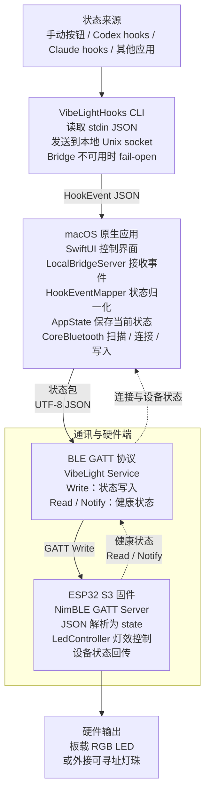
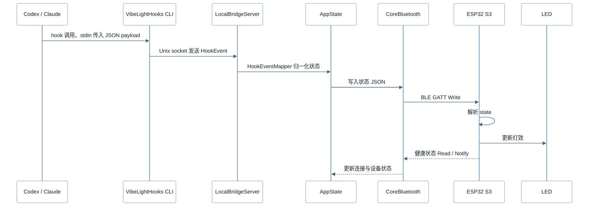

# Vibe Light 蓝牙状态灯实现计划

**目标：**实现一个 macOS 原生应用，监听 Codex、Claude 等 AI 编程工具的运行状态，通过 BLE 与 ESP32 S3 通讯，并用 LED 展示当前状态。

**架构：**电脑端暂时只支持 macOS，使用 Swift + SwiftUI 实现原生应用。应用负责展示控制界面、启动本地 Bridge、接收 Codex / Claude hook 事件，并通过 CoreBluetooth 向 ESP32 S3 发送标准化状态包。Codex / Claude 的 hook 调用轻量级 `VibeLightHooks` CLI，CLI 将 stdin 中的 JSON payload 通过本地 Unix socket 发给 macOS 应用；Bridge 不可用时 CLI 直接退出，避免影响原工具运行。ESP32 S3 作为 BLE 外设，暴露一个状态写入特征和一个设备健康状态特征；固件收到状态后驱动板载 RGB LED 或外接可寻址灯珠。第一阶段先完成“macOS 应用手动发送状态 -> ESP32 S3 接收 -> LED 变化”的闭环，再接入 hook 状态流。

**技术栈：**Swift、SwiftUI、CoreBluetooth、SwiftPM、XCTest、Unix domain socket、PlatformIO、Arduino ESP32、NimBLE-Arduino、FastLED。

---

## 架构总览
<div style="background:#fff">



</div>

## 核心流程
<div style="background:#fff">


</div>

## 协议约定

BLE 设备名称前缀：`VibeLight`

服务 UUID：`7d8f0001-7b9a-4f0b-9e8a-8b4c2c7f1000`

状态写入特征 UUID：`7d8f0002-7b9a-4f0b-9e8a-8b4c2c7f1000`

健康状态读取 / 通知特征 UUID：`7d8f0003-7b9a-4f0b-9e8a-8b4c2c7f1000`

状态包使用 UTF-8 JSON：

```json
{
  "v": 1,
  "source": "codex",
  "state": "busy",
  "detail": "running",
  "ts": 1780300800000
}
```

`source` 可选值：`manual`、`codex`、`claude`、`other`。

`state` 可选值：`idle`、`busy`、`waiting`、`success`、`error`、`offline`。

LED 默认效果：

```text
idle    -> 柔和白色呼吸
busy    -> 蓝色脉冲
waiting -> 紫色慢脉冲
success -> 绿色闪烁后回到 idle
error   -> 红色双闪后回到 idle
offline -> 琥珀色慢闪
```

## Hook 状态映射

第一版只把 Codex / Claude 的 hook 事件归一化为 LED 需要的少量状态，不在硬件层暴露复杂会话细节。

| Hook 事件 | LED 状态 | 说明 |
| --- | --- | --- |
| `SessionStart` | `busy` | 新会话启动或恢复。 |
| `UserPromptSubmit` | `busy` | 用户提交了新任务。 |
| `PreToolUse` | `busy` | 工具即将执行。 |
| `PostToolUse` | `busy` | 单个工具完成，但本轮可能仍在继续。 |
| `PermissionRequest` | `waiting` | 工具等待用户批准或回答。 |
| `Stop` | `success` | 当前轮次完成。 |
| `SessionEnd` | `success` | 会话结束。 |
| `PostToolUseFailure` / `StopFailure` / `PermissionDenied` | `error` | 工具失败、轮次失败或权限被拒绝。 |

## 文件结构

```text
README.md
docs/protocol.md
docs/architecture.md
apps/macos/Package.swift
apps/macos/Sources/VibeLightApp/App/VibeLightApp.swift
apps/macos/Sources/VibeLightApp/Views/ContentView.swift
apps/macos/Sources/VibeLightApp/Views/DeviceStatusView.swift
apps/macos/Sources/VibeLightApp/Views/ManualStatusControls.swift
apps/macos/Sources/VibeLightCore/Models/StatusPacket.swift
apps/macos/Sources/VibeLightCore/Models/HookEvent.swift
apps/macos/Sources/VibeLightCore/Services/HookEventMapper.swift
apps/macos/Sources/VibeLightHooks/VibeLightHooksCLI.swift
apps/macos/Sources/VibeLightApp/Stores/AppState.swift
apps/macos/Sources/VibeLightApp/Services/VibeLightBLEClient.swift
apps/macos/Sources/VibeLightApp/Services/LocalBridgeServer.swift
apps/macos/Tests/VibeLightAppTests/StatusPacketTests.swift
apps/macos/Tests/VibeLightAppTests/HookEventMapperTests.swift
firmware/esp32-s3/platformio.ini
firmware/esp32-s3/src/main.cpp
firmware/esp32-s3/src/VibeBleServer.h
firmware/esp32-s3/src/VibeBleServer.cpp
firmware/esp32-s3/src/LedController.h
firmware/esp32-s3/src/LedController.cpp
```

## 任务 1：补齐中文项目文档与协议文档

**文件：**
- 修改：`README.md`
- 新建：`docs/protocol.md`

- [ ] **步骤 1：将 README 改为中文项目说明**

```markdown
# vibe-light

`vibe-light` 用于把本机 AI 编程工具的运行状态同步到实体 LED 状态灯。

项目分为两部分：

- `apps/macos`：macOS 原生状态中心，负责接收 Codex / Claude hook 状态、连接硬件并发送 BLE 状态包。
- `firmware/esp32-s3`：ESP32 S3 固件，负责暴露 BLE 服务并驱动 LED。

第一版电脑端只支持 macOS。
第一版硬件目标是 ESP32 S3 开发板，支持板载 RGB LED 或单颗外接可寻址灯珠。
第一版通讯方式是 BLE GATT。

## 状态模型

| 状态 | 含义 | 默认 LED 效果 |
| --- | --- | --- |
| `idle` | 当前没有检测到活跃任务 | 柔和白色呼吸 |
| `busy` | 工具正在运行或等待任务完成 | 蓝色脉冲 |
| `waiting` | 工具正在等待用户批准或回答 | 紫色慢脉冲 |
| `success` | 最近一次任务成功完成 | 绿色闪烁 |
| `error` | 最近一次任务失败或需要处理 | 红色双闪 |
| `offline` | macOS 应用未连接硬件 | 琥珀色慢闪 |

## 开发里程碑

1. macOS 应用可以手动连接 ESP32 S3 并发送测试状态。
2. 固件可以接收 BLE 状态包并驱动 LED。
3. macOS 应用可以通过 hook 接收 Codex 和 Claude 的运行状态。
4. 用户可以在界面中配置应用与 LED 状态的映射。
```

- [ ] **步骤 2：创建中文 BLE 协议文档**

```markdown
# BLE 协议

BLE 设备名称前缀：`VibeLight`

服务 UUID：`7d8f0001-7b9a-4f0b-9e8a-8b4c2c7f1000`

状态写入特征 UUID：`7d8f0002-7b9a-4f0b-9e8a-8b4c2c7f1000`

健康状态读取 / 通知特征 UUID：`7d8f0003-7b9a-4f0b-9e8a-8b4c2c7f1000`

## 状态包

macOS 应用将 UTF-8 JSON 写入状态特征：

```json
{
  "v": 1,
  "source": "codex",
  "state": "busy",
  "detail": "running",
  "ts": 1780300800000
}
```

| 字段 | 类型 | 必填 | 说明 |
| --- | --- | --- | --- |
| `v` | number | 是 | 协议版本。当前固定为 `1`。 |
| `source` | string | 是 | 状态来源，可选值：`manual`、`codex`、`claude`、`other`。 |
| `state` | string | 是 | 状态值，可选值：`idle`、`busy`、`waiting`、`success`、`error`、`offline`。 |
| `detail` | string | 否 | 简短诊断信息，主要用于界面展示和调试。 |
| `ts` | number | 是 | macOS 应用生成的 Unix 毫秒时间戳。 |

## 健康状态包

固件通过健康状态特征返回设备状态：

```json
{
  "v": 1,
  "device": "VibeLight-S3",
  "uptimeMs": 12000,
  "connected": true,
  "lastState": "busy"
}
```
```

- [ ] **步骤 3：验证文档存在**

```bash
test -f README.md && test -f docs/protocol.md
```

预期：命令退出码为 `0`。

- [ ] **步骤 4：提交**

```bash
git add README.md docs/protocol.md docs/architecture.md
git commit -m "docs: define vibe light protocol"
```

## 任务 2：创建 macOS 应用骨架与协议模型

**文件：**
- 新建：`apps/macos/Package.swift`
- 新建：`apps/macos/Sources/VibeLightApp/App/VibeLightApp.swift`
- 新建：`apps/macos/Sources/VibeLightCore/Models/StatusPacket.swift`
- 新建：`apps/macos/Sources/VibeLightCore/Models/HookEvent.swift`
- 新建：`apps/macos/Tests/VibeLightAppTests/StatusPacketTests.swift`

- [ ] **步骤 1：创建 SwiftPM 包**

```swift
// swift-tools-version: 6.0

import PackageDescription

let package = Package(
    name: "VibeLight",
    platforms: [
        .macOS(.v14)
    ],
    products: [
        .library(name: "VibeLightCore", targets: ["VibeLightCore"]),
        .executable(name: "VibeLightApp", targets: ["VibeLightApp"]),
        .executable(name: "VibeLightHooks", targets: ["VibeLightHooks"])
    ],
    targets: [
        .target(name: "VibeLightCore"),
        .executableTarget(name: "VibeLightApp", dependencies: ["VibeLightCore"]),
        .executableTarget(name: "VibeLightHooks", dependencies: ["VibeLightCore"]),
        .testTarget(name: "VibeLightAppTests", dependencies: ["VibeLightCore"])
    ]
)
```

- [ ] **步骤 2：创建状态模型**

```swift
import Foundation

enum StatusSource: String, Codable, CaseIterable, Sendable {
    case manual
    case codex
    case claude
    case other
}

enum StatusState: String, Codable, CaseIterable, Sendable {
    case idle
    case busy
    case waiting
    case success
    case error
    case offline
}

struct StatusPacket: Codable, Equatable, Sendable {
    let v: Int
    let source: StatusSource
    let state: StatusState
    let detail: String?
    let ts: Int64

    init(source: StatusSource, state: StatusState, detail: String?, ts: Int64) {
        self.v = 1
        self.source = source
        self.state = state
        self.detail = detail
        self.ts = ts
    }

    func encoded() throws -> Data {
        try JSONEncoder().encode(self)
    }
}
```

- [ ] **步骤 3：创建 hook 事件模型**

```swift
import Foundation

enum HookSource: String, Codable, Sendable {
    case codex
    case claude
    case other
}

enum HookEventName: String, Codable, Sendable {
    case sessionStart = "SessionStart"
    case sessionEnd = "SessionEnd"
    case userPromptSubmit = "UserPromptSubmit"
    case preToolUse = "PreToolUse"
    case postToolUse = "PostToolUse"
    case postToolUseFailure = "PostToolUseFailure"
    case permissionRequest = "PermissionRequest"
    case permissionDenied = "PermissionDenied"
    case notification = "Notification"
    case stop = "Stop"
    case stopFailure = "StopFailure"
    case subagentStart = "SubagentStart"
    case subagentStop = "SubagentStop"
    case unknown
}

struct HookEvent: Codable, Equatable, Sendable {
    let source: HookSource
    let eventName: HookEventName
    let sessionID: String
    let cwd: String?
    let toolName: String?
    let detail: String?
    let receivedAt: Date
}
```

- [ ] **步骤 4：用测试固定 JSON 编码格式**

```swift
import XCTest
@testable import VibeLightCore

final class StatusPacketTests: XCTestCase {
    func testEncodesStatusPacket() throws {
        let packet = StatusPacket(source: .codex, state: .busy, detail: "running", ts: 1780300800000)
        let object = try JSONSerialization.jsonObject(with: packet.encoded()) as? [String: Any]

        XCTAssertEqual(object?["v"] as? Int, 1)
        XCTAssertEqual(object?["source"] as? String, "codex")
        XCTAssertEqual(object?["state"] as? String, "busy")
        XCTAssertEqual(object?["detail"] as? String, "running")
        XCTAssertEqual(object?["ts"] as? Int64, 1780300800000)
    }
}
```

- [ ] **步骤 5：创建最小 macOS 应用入口**

```swift
import SwiftUI
import VibeLightCore

@main
struct VibeLightApp: App {
    var body: some Scene {
        WindowGroup {
            ContentView()
        }
    }
}
```

- [ ] **步骤 6：验证构建和测试**

```bash
cd apps/macos
swift test
swift build
```

预期：全部通过。

- [ ] **步骤 7：提交**

```bash
git add apps/macos
git commit -m "feat: add native macos status model"
```

## 任务 3：实现 CoreBluetooth 客户端边界

**文件：**
- 新建：`apps/macos/Sources/VibeLightApp/Services/VibeLightBLEClient.swift`

- [ ] **步骤 1：定义 BLE 常量和客户端状态**

```swift
import CoreBluetooth
import Foundation
import Observation

let vibeLightServiceUUID = CBUUID(string: "7d8f0001-7b9a-4f0b-9e8a-8b4c2c7f1000")
let vibeLightStatusUUID = CBUUID(string: "7d8f0002-7b9a-4f0b-9e8a-8b4c2c7f1000")
let vibeLightHealthUUID = CBUUID(string: "7d8f0003-7b9a-4f0b-9e8a-8b4c2c7f1000")

enum BLEConnectionState: Equatable {
    case unavailable
    case idle
    case scanning
    case connecting(String)
    case connected(String)
    case failed(String)
}
```

- [ ] **步骤 2：实现 CoreBluetooth 扫描、连接和写入**

```swift
@MainActor
@Observable
final class VibeLightBLEClient: NSObject {
    private var centralManager: CBCentralManager?
    private var peripheral: CBPeripheral?
    private var statusCharacteristic: CBCharacteristic?

    var state: BLEConnectionState = .idle

    func start() {
        centralManager = CBCentralManager(delegate: self, queue: nil)
    }

    func scan() {
        guard centralManager?.state == .poweredOn else {
            state = .unavailable
            return
        }
        state = .scanning
        centralManager?.scanForPeripherals(withServices: [vibeLightServiceUUID])
    }

    func send(_ packet: StatusPacket) throws {
        guard let peripheral, let statusCharacteristic else {
            state = .failed("device-not-connected")
            return
        }
        peripheral.writeValue(try packet.encoded(), for: statusCharacteristic, type: .withResponse)
    }
}
```

继续在同一文件中实现 `CBCentralManagerDelegate` 和 `CBPeripheralDelegate`，发现 `VibeLight` 设备后连接，发现服务后保存状态写入特征。

- [ ] **步骤 3：验证构建**

```bash
cd apps/macos
swift build
```

预期：构建通过。

- [ ] **步骤 4：提交**

```bash
git add apps/macos/Sources/VibeLightApp/Services/VibeLightBLEClient.swift
git commit -m "feat: add macos ble client"
```

## 任务 4：创建 macOS 手动控制界面

**文件：**
- 新建：`apps/macos/Sources/VibeLightApp/Views/ContentView.swift`
- 新建：`apps/macos/Sources/VibeLightApp/Views/DeviceStatusView.swift`
- 新建：`apps/macos/Sources/VibeLightApp/Views/ManualStatusControls.swift`
- 新建：`apps/macos/Sources/VibeLightApp/Stores/AppState.swift`

- [ ] **步骤 1：创建应用状态容器**

`AppState` 持有 `VibeLightBLEClient`、`LocalBridgeServer`、当前选中状态、最近一次发送时间和错误信息。视图通过 SwiftUI 绑定触发扫描、连接和手动发送；Bridge 收到 hook 事件后也通过同一条 `AppState -> StatusPacket -> BLE` 路径更新硬件。

- [ ] **步骤 2：创建主界面**

界面第一版只保留三块内容：

- 顶部设备连接状态与“扫描”按钮。
- 中间 LED 状态预览。
- 底部六个手动状态按钮：`idle`、`busy`、`waiting`、`success`、`error`、`offline`。

不要把第一版做成设置页或复杂仪表盘；先让硬件闭环跑通。

- [ ] **步骤 3：验证构建和运行**

```bash
cd apps/macos
swift build
swift run VibeLightApp
```

预期：应用窗口启动，显示设备状态、LED 预览和六个状态按钮。

- [ ] **步骤 4：提交**

```bash
git add apps/macos/Sources/VibeLightApp
git commit -m "feat: add native macos manual controls"
```

## 任务 5：创建 ESP32 S3 固件骨架

**文件：**
- 新建：`firmware/esp32-s3/platformio.ini`
- 新建：`firmware/esp32-s3/src/main.cpp`
- 新建：`firmware/esp32-s3/src/LedController.h`
- 新建：`firmware/esp32-s3/src/LedController.cpp`

- [ ] **步骤 1：创建 PlatformIO 配置**

```ini
[env:esp32-s3-devkitc-1]
platform = espressif32
board = esp32-s3-devkitc-1
framework = arduino
monitor_speed = 115200
lib_deps =
  fastled/FastLED@^3.9.0
  h2zero/NimBLE-Arduino@^2.2.0
build_flags =
  -D VIBE_LED_PIN=48
  -D VIBE_LED_COUNT=1
```

- [ ] **步骤 2：实现 `LedController`**

`LedController` 负责保存当前状态，并在 `tick()` 中根据状态更新 LED。状态映射遵循本计划开头的协议约定。

- [ ] **步骤 3：创建固件入口**

```cpp
#include <Arduino.h>

#include "LedController.h"

LedController ledController;

void setup() {
  Serial.begin(115200);
  ledController.begin();
}

void loop() {
  ledController.tick();
  delay(16);
}
```

- [ ] **步骤 4：构建固件**

```bash
cd firmware/esp32-s3
pio run
```

预期：构建通过。

- [ ] **步骤 5：提交**

```bash
git add firmware/esp32-s3
git commit -m "feat: add esp32 s3 led firmware"
```

## 任务 6：加入 ESP32 BLE 服务

**文件：**
- 修改：`firmware/esp32-s3/src/main.cpp`
- 新建：`firmware/esp32-s3/src/VibeBleServer.h`
- 新建：`firmware/esp32-s3/src/VibeBleServer.cpp`

- [ ] **步骤 1：实现 BLE 服务**

固件启动后广播设备名 `VibeLight-S3`，并暴露以下特征：

- 状态写入特征：接收 macOS 应用写入的状态 JSON，并调用 `LedController::setState()`。
- 健康状态特征：返回设备名、运行时间、连接状态和最近一次状态。

- [ ] **步骤 2：在 `main.cpp` 中启动 BLE 服务**

```cpp
#include <Arduino.h>

#include "LedController.h"
#include "VibeBleServer.h"

LedController ledController;
VibeBleServer bleServer(ledController);

void setup() {
  Serial.begin(115200);
  ledController.begin();
  bleServer.begin();
}

void loop() {
  bleServer.tick();
  ledController.tick();
  delay(16);
}
```

- [ ] **步骤 3：构建固件**

```bash
cd firmware/esp32-s3
pio run
```

预期：构建通过。

- [ ] **步骤 4：提交**

```bash
git add firmware/esp32-s3
git commit -m "feat: expose vibe light ble service"
```

## 任务 7：加入 Codex 和 Claude Hook 状态流

**文件：**
- 新建：`apps/macos/Sources/VibeLightCore/Services/HookEventMapper.swift`
- 新建：`apps/macos/Sources/VibeLightHooks/VibeLightHooksCLI.swift`
- 新建：`apps/macos/Sources/VibeLightApp/Services/LocalBridgeServer.swift`
- 新建：`apps/macos/Tests/VibeLightAppTests/HookEventMapperTests.swift`

- [ ] **步骤 1：用测试定义 hook 事件到 LED 状态的映射**

```swift
import XCTest
@testable import VibeLightCore

final class HookEventMapperTests: XCTestCase {
    func testMapsPromptSubmitToBusy() {
        let status = HookEventMapper.map(
            HookEvent(
                source: .codex,
                eventName: .userPromptSubmit,
                sessionID: "s1",
                cwd: "/tmp/project",
                toolName: nil,
                detail: "Prompt submitted",
                receivedAt: Date(timeIntervalSince1970: 0)
            )
        )

        XCTAssertEqual(status.source, .codex)
        XCTAssertEqual(status.state, .busy)
        XCTAssertEqual(status.detail, "Prompt submitted")
    }

    func testMapsPermissionRequestToWaiting() {
        let status = HookEventMapper.map(
            HookEvent(
                source: .claude,
                eventName: .permissionRequest,
                sessionID: "s2",
                cwd: "/tmp/project",
                toolName: "Bash",
                detail: nil,
                receivedAt: Date(timeIntervalSince1970: 0)
            )
        )

        XCTAssertEqual(status.source, .claude)
        XCTAssertEqual(status.state, .waiting)
        XCTAssertEqual(status.detail, "waiting:PermissionRequest")
    }

    func testMapsStopToSuccess() {
        let status = HookEventMapper.map(
            HookEvent(
                source: .codex,
                eventName: .stop,
                sessionID: "s3",
                cwd: nil,
                toolName: nil,
                detail: "Turn complete",
                receivedAt: Date(timeIntervalSince1970: 0)
            )
        )

        XCTAssertEqual(status.state, .success)
    }

    func testMapsFailuresToError() {
        let status = HookEventMapper.map(
            HookEvent(
                source: .claude,
                eventName: .stopFailure,
                sessionID: "s4",
                cwd: nil,
                toolName: nil,
                detail: "Tool failed",
                receivedAt: Date(timeIntervalSince1970: 0)
            )
        )

        XCTAssertEqual(status.state, .error)
    }
}
```

- [ ] **步骤 2：实现 hook 事件映射器**

```swift
struct ToolStatus: Equatable, Sendable {
    let source: StatusSource
    let state: StatusState
    let detail: String
}

enum HookEventMapper {
    static func map(_ event: HookEvent) -> ToolStatus {
        let source: StatusSource = switch event.source {
        case .codex: .codex
        case .claude: .claude
        case .other: .other
        }

        switch event.eventName {
        case .sessionStart, .userPromptSubmit, .preToolUse, .postToolUse, .subagentStart, .subagentStop:
            return ToolStatus(source: source, state: .busy, detail: event.detail ?? "running:\(event.eventName.rawValue)")
        case .permissionRequest:
            return ToolStatus(source: source, state: .waiting, detail: event.detail ?? "waiting:\(event.eventName.rawValue)")
        case .stop, .sessionEnd:
            return ToolStatus(source: source, state: .success, detail: event.detail ?? "success:\(event.eventName.rawValue)")
        case .postToolUseFailure, .permissionDenied, .stopFailure:
            return ToolStatus(source: source, state: .error, detail: event.detail ?? "error:\(event.eventName.rawValue)")
        case .notification:
            return ToolStatus(source: source, state: .busy, detail: event.detail ?? "notification")
        case .unknown:
            return ToolStatus(source: source, state: .busy, detail: event.detail ?? "unknown-hook-event")
        }
    }
}
```

- [ ] **步骤 3：实现 `VibeLightHooks` CLI**

`VibeLightHooks` 是 Codex / Claude hook 调用的轻量 CLI。它读取 stdin 中的原始 JSON，根据 `--source codex` 或 `--source claude` 提取 `hook_event_name`、`session_id`、`cwd`、`tool_name`、`prompt`、`message` 等字段，编码成 `HookEvent` 后写入本地 Unix socket。socket 不存在、连接失败或 payload 无法解析时直接退出，不向 stdout 写入内容，保证 fail-open。

- [ ] **步骤 4：实现 macOS 应用内的 `LocalBridgeServer`**

`LocalBridgeServer` 在应用启动时监听用户级 socket，例如：

```text
~/Library/Application Support/VibeLight/bridge.sock
```

收到一行 JSON 后解码为 `HookEvent`，调用 `HookEventMapper.map(_:)` 得到 `ToolStatus`，再交给 `AppState` 生成 `StatusPacket` 并发送到 BLE。Bridge 只负责本机状态传递，不做权限批准或阻断。

- [ ] **步骤 5：补充 hook 安装说明**

第一版可以先不自动修改 Codex / Claude 配置，只在 README 中给出手动配置示例。后续再做可逆安装器。

Codex hook 建议先启用低噪音事件：`SessionStart`、`UserPromptSubmit`、`Stop`。如果用户需要更实时的命令级灯效，再手动启用 `PreToolUse` / `PostToolUse`。

Claude hook 可以覆盖更多事件：`SessionStart`、`UserPromptSubmit`、`PreToolUse`、`PermissionRequest`、`PostToolUse`、`PostToolUseFailure`、`Notification`、`Stop`、`StopFailure`、`SessionEnd`。

- [ ] **步骤 6：运行测试**

```bash
cd apps/macos
swift test
```

预期：全部通过。

- [ ] **步骤 7：提交**

```bash
git add apps/macos
git commit -m "feat: add local hook status bridge"
```

## 任务 8：端到端硬件验证

**文件：**
- 修改：`README.md`

- [ ] **步骤 1：补充中文硬件验证流程**

```markdown
## 硬件验证

1. 烧录固件：

   ```bash
   cd firmware/esp32-s3
   pio run --target upload
   ```

2. 启动 macOS 应用：

   ```bash
   cd apps/macos
   swift run VibeLightApp
   ```

3. 确认 ESP32 广播名称为 `VibeLight-S3`。
4. 在 macOS 应用中手动发送不同状态。
5. 用本地 hook CLI 模拟 Codex 事件：

   ```bash
   cd apps/macos
   printf '{"hook_event_name":"UserPromptSubmit","session_id":"demo","cwd":"%s","prompt":"demo"}\n' "$PWD" \
     | swift run VibeLightHooks --source codex
   ```

6. 确认 LED 效果：

   | 状态 | 预期效果 |
   | --- | --- |
   | `idle` | 柔和白色呼吸 |
   | `busy` | 蓝色脉冲 |
   | `waiting` | 紫色慢脉冲 |
   | `success` | 绿色闪烁后回到 `idle` |
   | `error` | 红色双闪后回到 `idle` |
   | `offline` | 琥珀色慢闪 |
```

- [ ] **步骤 2：验证 macOS 应用**

```bash
cd apps/macos
swift test
swift build
```

预期：全部通过。

- [ ] **步骤 3：验证固件**

```bash
cd firmware/esp32-s3
pio run
```

预期：构建通过。

- [ ] **步骤 4：提交**

```bash
git add README.md
git commit -m "docs: add hardware verification flow"
```

## 自检

需求覆盖：

- macOS 原生电脑端应用：任务 2、任务 3、任务 4、任务 7 覆盖。
- Codex 和 Claude 状态检测：任务 7 使用 hook-first 状态流，进程检测只作为后续兜底能力考虑。
- BLE 通讯：任务 3 和任务 6 覆盖。
- ESP32 S3 固件：任务 5 和任务 6 覆盖。
- LED 状态灯：任务 5 和任务 8 覆盖。

一致性检查：

- 协议 UUID 在文档、macOS 应用和固件中保持一致。
- 状态值统一使用 `idle`、`busy`、`waiting`、`success`、`error`、`offline`。
- 代码标识符和协议字段保留英文，说明文档使用中文。
